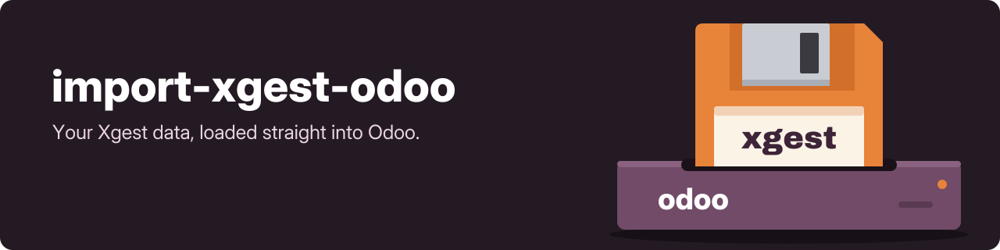

<h1 align="center">import-xgest-odoo</h1>

  

<strong>Migration scripts between Xgest and Odoo ERPs</strong>

---

Helping script to ease the transition between both ERPs.

## Author

* **GeiserX** - *Creator* - [GeiserX](https://github.com/GeiserX)

## License

This project is licensed under the GNU General Public License v3.0 or later (GPL-3.0-or-later). See [LICENSE](LICENSE).
